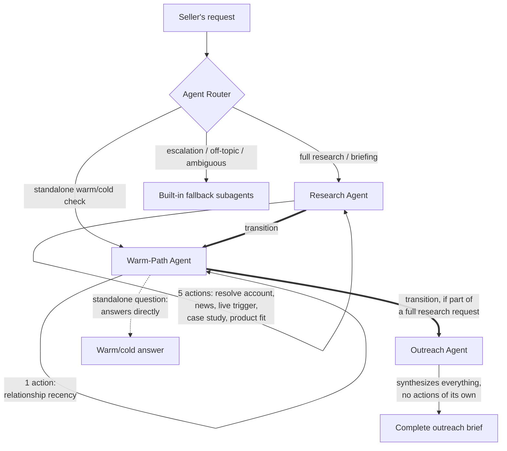
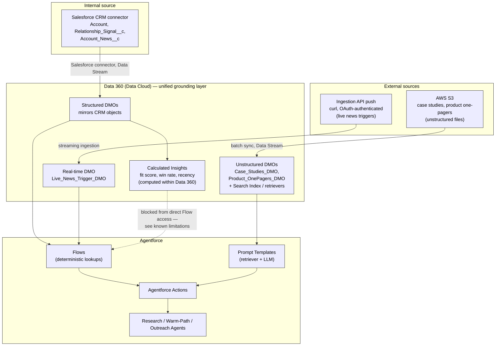

# Sales Lead Engagement Agent

Multi-agent system using Salesforce Data360 and Agentforce

## The scenario

**The challenge:** Sellers spend hours researching prospects before outreach,
or worse, skip the research and send generic messages that get ignored. The
information they need exists in the CRM, in news feeds, in relationship data
across the organization — but assembling it for each prospect is manual and
slow. Competitors who personalize effectively win the first conversation.

**The opportunity:** Deploy agents that research prospects, identify warm
paths through existing relationships, and draft personalized outreach
grounded in real context. Before a seller ever reaches out, the agent has
assembled a briefing: company news, relevant triggers, mutual connections,
and talking points tailored to that prospect's situation.

**Who should act:** Sales ops and marketing ops teams configure and tune
these agents using their knowledge of ICP, messaging frameworks, and CRM
structures. Developers lead when integrating proprietary data sources,
building custom scoring models, or connecting marketing automation platforms
beyond standard connectors.

**Reference customer example:** A B2B technology company deployed a lead
enrichment agent running nightly against inbound leads — flagging existing
relationships, scoring fit, and pulling recent news — with sellers receiving
a prioritized morning briefing. This build extends that pattern from a
nightly batch job to an on-demand, real-time capable agent.

---

## What this system does

A seller asks one question — *"Research Edge Communications for me"* — and
receives a complete briefing in one response: account snapshot, recent news,
any live/urgent trigger, a relevant case study, a product fit
recommendation, warm/cold relationship status, and a suggested opening line.

---

## Architecture — multi-agent system

**Key architectural finding:** Agentforce's built-in Agent Router only
supports single-hop routing — it hands off to exactly one subagent per turn
and cannot itself orchestrate a multi-step sequence across subagents. The
working pattern discovered through testing is a **subagent-to-subagent
transition chain** (`@utils.transition to @subagent.X`), where each
subagent's own reasoning — not the router — decides when to hand off next.
Research Agent runs its own actions, then transitions to Warm-Path Agent,
which conditionally transitions to Outreach Agent for final synthesis. This
forms a directed, three-hop chain within a single user turn — reachable only
this way, since Outreach Agent has no actions of its own and is never routed
to directly.

---

## Architecture — Data 360 as the grounding layer

**Why this split matters:** Data 360 is the single unified layer beneath
Agentforce — structured CRM data, computed insights, unstructured documents,
and real-time streamed events all live here, regardless of source or shape.
Agentforce never touches raw data directly; every action grounds itself
through either a Flow (deterministic, one right answer) or a Prompt Template
plus retriever (semantic, judgment-based). The one dotted line marks a real,
diagnosed limitation: Calculated Insight objects are blocked from Flow's Get
Records in this environment, so `Account_Fit_Score_Final` — though fully
computed and verified in Data 360 — isn't yet wired into the agent layer.
Everything else in this diagram is a proven, working connection.

---

## Advance delivery

- **Multi-agent collaboration** — three specialist subagents (Research,
  Warm-Path, Outreach) chained via subagent-to-subagent transitions, a
  pattern discovered through hands-on testing rather than assumed from
  documentation.
- **Real-time data processing / streaming architecture** — a full external
  ingestion pipeline: OAuth (Client Credentials Flow + CDP token exchange) →
  Ingestion API → Data Lake Object → Data Model Object → Flow → Agentforce
  Action → agent response, proven live with real `curl` pushes landing in
  the agent's response within ~1–2 minutes.
- **Novel integration pattern** — the Ingestion API path is a genuinely
  external, authenticated integration (not a standard Salesforce connector),
  pushing simulated "live news trigger" events from outside the platform.
- **Trust, safety, and governance** — explicit anti-hallucination
  instructions in every Prompt Template (case study and product fit actions
  are instructed to say "no relevant match found" rather than invent one,
  and verified honest across multiple industries outside the seeded case
  study set); a real bug was found and fixed where an account name was
  passed where a resolved ID was expected, producing a plausible-but-wrong
  "cold account" answer — caught through systematic adversarial testing, not
  left undiscovered.

  ## Testing coverage

Validated across: warm accounts with full data (Edge Communications,
GenePoint), cold accounts with no relationship or case study match
(Dickenson plc), nonexistent accounts (clean early exit), industries outside
the four seeded case studies (Consulting, Transportation — both degrade
honestly), standalone relationship-only questions (no unnecessary chain
triggered), varied phrasing robustness ("research X" vs. "give me a briefing
on X"), and live real-time trigger ingestion on two separate accounts pushed
during testing.